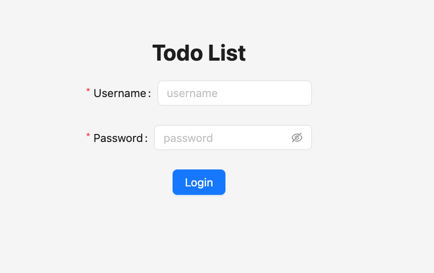
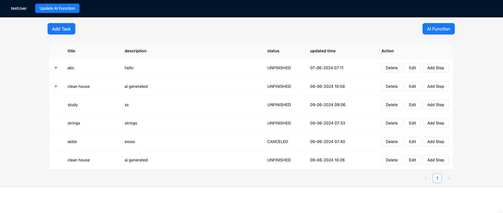
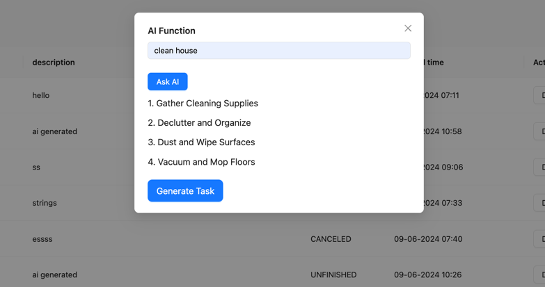
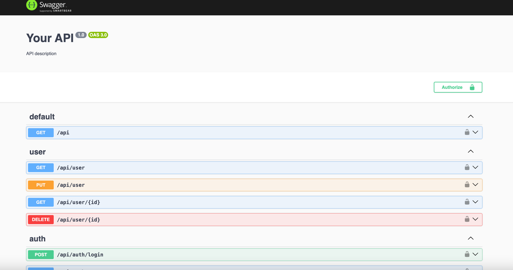
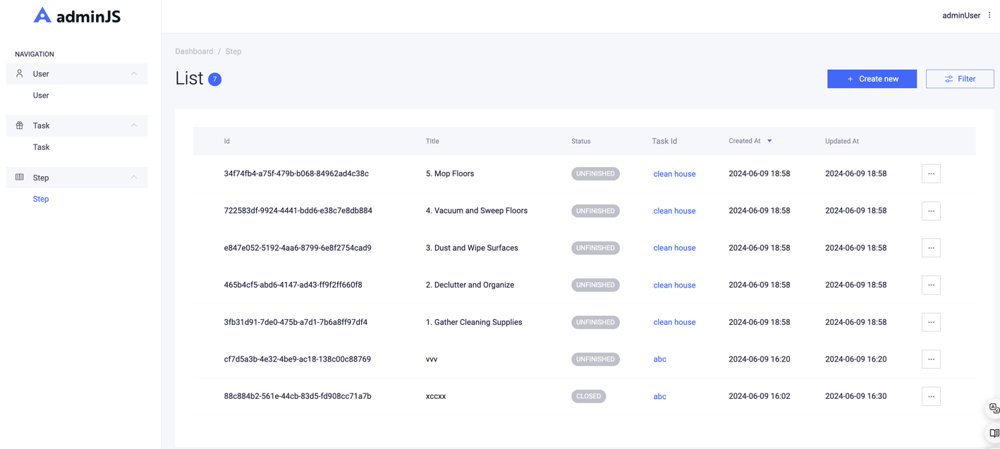
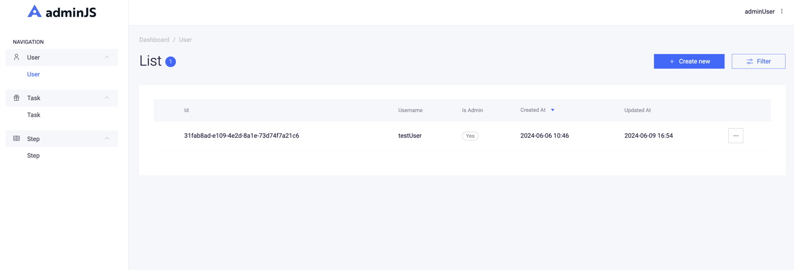

# Todo

<a alt="Nx logo" href="https://nx.dev" target="_blank" rel="noreferrer"></a>

✨ **This workspace has been generated by [Nx, Smart Monorepos · Fast CI.](https://nx.dev)** ✨

## Project Structure
- apps
  - backend
    - framework: nestjs
    - database: postgres
    - orm: typeorm
    - admin: adminjs
    - api document: swagger
  - frontend
    - framework: react
    - ui: antd

## Getting Started
to create a postgres DB: 

```
psql 
CREATE DATABASE todo_backend;
``` 

The first time you want to run the backend you'll need to run the migrations so that the DB tables are created:
```
yarn run migration:run
```

then you can run the server:
```
yarn run start:all
```
## Interface Introduction
- backend: http://localhost:3000
- frontend: http://localhost:4200

login page:  
you can create a new account by swagger ui or admin js, and then login with the account.



function page:
- you can add a new todo task, delete a todo task, and update a todo task.
- you can add a new step under a task, delete a step, and update a step.


**<font color='red' size='4'>you can buy AI function to auto-generate a todo task.</font>**

    
- swagger: http://localhost:3000/api 
you can test the api by swagger ui.

- admin: http://localhost:3000/admin (default user: adminUser, password: adminUser)  
you already have a admin management platform, you can edit, create, delete the todo task and step, or user.



## Development

```
# generating migrations
yarn run migration:generate --name xxx

# running migrations
yarn run migration:run

# starting all services
yarn run start:all
```
